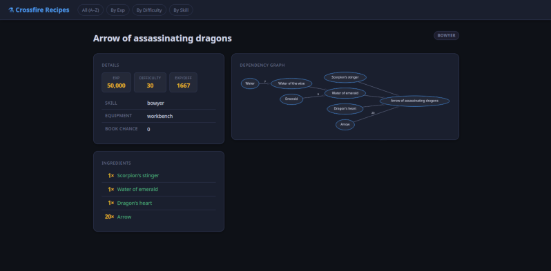

# Crossfire Crafting Spoiler Web GUI

A static site generator for [Crossfire](https://crossfire.real-time.com/) crafting recipes, built from a server dump produced with the `-m7` switch.

The output is a fully self-contained directory of HTML files — no server required, no database, no JavaScript framework. Open `site/index.html` directly in a browser or drop the folder on any static host.

---

## 📸 Screenshots

### Sample Crafting Recipe



---

## Features

- **442 recipes** across 6 skills: alchemy, bowyer, jeweler, smithery, thaumaturgy, woodsman
- **886 pages** — every ingredient gets its own page showing which recipes use it
- **Dependency graphs** rendered as inline SVG via Graphviz — scalable, with clickable nodes
- **Four index views**: A–Z, by experience, by difficulty, by skill
- **Live search and sortable columns** on every index page — no page reload
- **Profit / loss indicator** per recipe, calculated from ingredient cost vs. result value
- **Yield**, **exp/difficulty ratio**, and **book chance** shown where available
- Dark theme, responsive layout, no external dependencies at runtime

---

## Requirements

Python 3.12+, Jinja2, and Graphviz. Install using the package manager for your distribution:

**Ubuntu / Debian**
```bash
sudo apt install python3 python3-jinja2 graphviz
```

**Linux Mint**
Linux Mint is Ubuntu-based and uses the same `apt` packages:
```bash
sudo apt install python3 python3-jinja2 graphviz
```

**Fedora**
```bash
sudo dnf install python3 python3-jinja2 graphviz
```

| Package | Purpose |
|---|---|
| `python3` | Runtime (3.12+) |
| `python3-jinja2` | HTML templating |
| `graphviz` | Renders dependency graphs as SVG |

Graphviz is optional. Without it, recipe pages are generated without dependency graphs and everything else works normally.

---

## Quick start

```bash
git clone https://github.com/tannerrj/crossfire-crafting-spoiler-web-gui
cd crossfire-crafting-spoiler-web-gui

make

# Browse the result
python3 -m http.server 8080 --directory site/
# → http://localhost:8080
```

### Make targets

| Command | Effect |
|---|---|
| `make` | Full build — all three stages |
| `make fast` | Skip Graphviz; generates pages without graphs |
| `make rebuild` | Force-regenerate all HTML pages |
| `make parse` | Stage 1 only: `m7.txt` → `all.json` |
| `make index` | Stage 2 only: `all.json` → `indexed.json` |
| `make site` | Stage 3 only: `indexed.json` → `site/` |
| `make clean` | Remove all generated files |

---

## How it works

The build pipeline has three stages:

```
m7.txt ──► parse_m7.py ──► all.json
                                │
                       index_recipes.py ──► indexed.json
                                                  │
                                          build_site.py ──► site/
```

**Stage 1 — `parse_m7.py`**
Reads the CSV dump and outputs `all.json`: a clean, sorted array of recipe objects. Handles name normalisation (expanding internal prefixes like `phil_`, `potion_generic`, `balm_generic` into readable names), ingredient parsing, and duplicate filtering.

**Stage 2 — `index_recipes.py`**
Builds forward and reverse indexes. Every ingredient gains a `usedBy` list pointing back to the recipes that need it, and a `minimum` field recording the smallest quantity required across all those recipes. Ingredient-only items that have no recipe of their own get stub entries so they can have pages too.

**Stage 3 — `build_site.py`**
Renders Jinja2 templates into `site/`. One HTML page per recipe and per ingredient stub, plus four index pages. For each recipe with ingredients it builds a DOT graph, pipes it through `dot -Tsvg`, strips the XML declaration, and embeds the resulting SVG directly into the page.

The intermediate files `all.json` and `indexed.json` are plain JSON — open them in any editor to inspect or debug the data at any stage of the pipeline.

---

## Input format

The `m7.txt` file is a CSV export from a Crossfire server with the `-m7` flag:

```
name,index,num_ingreds,chance,skill,difficulty,exp,cauldron,yield,ingredients,ingred_price,result_price
water of the wise,3829,1,30,alchemy,8,1000,cauldron,7,"7 water(3829)",140,200
mushroom_1 of Gourmet,7847,2,40,woodsman,5,2000,stove,7,"water of the wise(1617),7 mushroom(6230)",368,40
```

Each ingredient in the `ingredients` field is `[count ]name(object_id)`. Rows with `skill=(null)` are item-splitting recipes with no associated crafting skill.

The included `m7.txt` was exported from a Crossfire server and may differ from exports produced by current builds.

---

## Repository layout

```
crossfire-m7/
├── m7.txt                  Source data (server dump)
├── parse_m7.py             Stage 1: CSV parser
├── index_recipes.py        Stage 2: forward/reverse indexer
├── build_site.py           Stage 3: site builder
├── Makefile
├── templates/
│   ├── base.html.j2        Shared layout, nav, and CSS variables
│   ├── index.html.j2       Sortable/searchable recipe list
│   └── recipe.html.j2      Individual recipe page with SVG graph
├── intro.txt               Original author's note (Mark Munro, 2016)
├── images/                 Screenshots used in README.md
├── html/                   Empty placeholder directory
├── README.md
├── CLAUDE.md               Developer guide (data model, quirks, extension notes)
├── .gitignore
├── all.json                Stage 1 output  (generated, not committed)
├── indexed.json            Stage 2 output  (generated, not committed)
└── site/                   Final site      (generated, not committed)
```

---

## Customisation

**Change the colour theme** — edit the `:root` CSS custom properties block in `templates/base.html.j2`. All colours are defined there; nothing is hardcoded elsewhere.

**Add a new index sort** — add a `write_index()` call in `build_site.py` and a nav link in `base.html.j2`.

**Show a new recipe field** — add a row to the `info-table` block in `templates/recipe.html.j2`. Wrap it in `` since not every recipe has every field.

**Use a different or updated m7.txt** — replace the file and run `make clean && make`. If new skills appear, add a `.badge-<skillname>` CSS class to `base.html.j2` and add the skill name to the badge allowlists in `index.html.j2` and `recipe.html.j2`.

---

## Background

This project is a Python rewrite of a set of Perl scripts originally written by Mark Munro in 2005 and shared with the Crossfire mailing list in 2016. The original used `HTML::Template`, `Data::Dumper` eval files, and Graphviz-generated GIFs with HTML image maps. This version replaces those with Jinja2, JSON intermediate files, and inline SVG.

The original author's description is preserved in `intro.txt`.

---

## License

Released under the same open-source spirit as the original material. See `intro.txt` for the original author's note.
